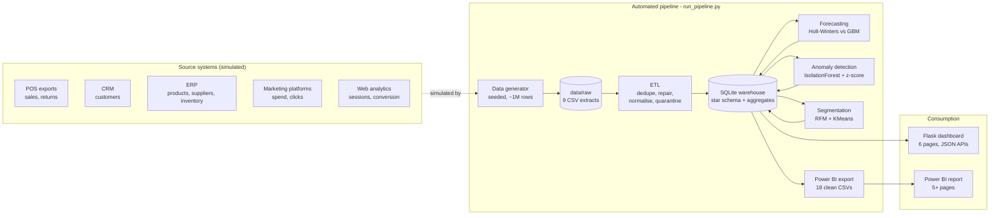

# Architecture

## System overview

## Design decisions

**Why synthetic data?** Client data is confidential. The generator simulates a
believable GCC retailer with controlled properties: weekly/annual seasonality
(Ramadan, Eid, Dubai Shopping Festival, White Friday, back-to-school), an
online-channel growth trend, promotion-driven discounting — and, crucially,
*known* injected incidents and data-quality defects. Knowing the ground truth
lets us **measure** the ETL and the ML instead of hand-waving ("the detector
found 7/8 injected incidents" is a much stronger claim than "it looks right").

**Why a star schema?** Facts (`fact_sales`, `fact_returns`, …) carry measures;
dimensions (`dim_date`, `dim_store`, `dim_product`, `dim_customer`) carry
descriptive attributes. This is the standard Kimball approach: it keeps BI
queries simple (join fact → dimension), matches Power BI's preferred model
shape, and lets both front-ends share one semantic layer.

**Why SQLite?** Zero-install, single-file, perfectly adequate for ~1.5M rows
with indexes — ideal for a local demo. The ETL code uses plain SQL + pandas,
so swapping to PostgreSQL or a cloud warehouse (Azure SQL / Synapse) is a
connection-string change, which is the answer to give when asked about scaling.

**Why pre-computed aggregate tables?** `agg_daily_kpis`, `agg_daily_store`,
`agg_daily_category` make dashboard endpoints O(days) instead of O(line items),
keeping every page under ~100 ms. Same pattern as materialised views in a
production warehouse.

**Why two forecasting models?** A statistical baseline (Holt-Winters — level,
trend, weekly seasonality) versus an ML challenger (Gradient Boosting on
calendar + lag features). Both are backtested on a 60-day holdout with MAPE;
the champion produces the official 90-day forecast with a widening 95%
interval. This "champion/challenger" framing shows methodological maturity.

**Why two anomaly detectors?** Isolation Forest looks at each day's KPIs
*jointly* (revenue, orders, basket, discount rate, margin rate, refunds) and
catches days that are only strange in combination — e.g. the injected pricing
bug where revenue was normal but margin collapsed. The rolling z-score works
per store and catches local incidents (POS outage, flood, returns-fraud
burst) that company-level totals would smooth away.

**Segmentation.** RFM features are log-transformed (heavy-tailed), scaled, and
clustered with KMeans (k=5). Clusters are auto-labelled from their centroids
(Champions, At Risk (High Value), Hibernating…). Each customer also gets a
recency-driven churn score and an annualised CLV estimate — which feed the
churn watchlist, i.e. a directly actionable output.

## Data quality strategy

The raw extracts deliberately contain the defects consultants meet in real
engagements; the ETL fixes each one and logs it to `dq_log`:

| Defect injected | Remediation |
|---|---|
| Duplicated POS export rows | drop duplicates on `transaction_id` |
| Mixed date formats (ISO + DD/MM/YYYY) | two-pass parsing, normalised to ISO |
| Zero / invalid prices | repaired from the product master |
| Negative quantities | quarantined (returns live in their own extract) |
| Messy payment labels (case/whitespace) | canonical mapping |
| Missing customer IDs | explicit NULL = guest checkout |
| Inconsistent city casing, duplicate emails | normalised / flagged |
| Orphan returns (no matching sale) | quarantined |

## Production path (talking point)

Local demo → production mapping: CSV drops → landing zone (S3/Azure Blob);
`run_pipeline.py` → orchestrator (Airflow / Azure Data Factory) on a schedule;
SQLite → PostgreSQL / Synapse; Flask → containerised app behind SSO;
Power BI Desktop → Power BI Service with scheduled refresh + gateway;
model retraining → the same ML stages re-run per refresh, with MAPE tracked
over time as a model-health metric.
